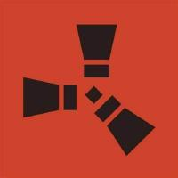

<!-- Improved compatibility of back to top link: See: https://github.com/othneildrew/Best-README-Template/pull/73 -->

<!--
*** Thanks for checking out the Best-README-Template. If you have a suggestion
*** that would make this better, please fork the repo and create a pull request
*** or simply open an issue with the tag "enhancement".
*** Don't forget to give the project a star!
*** Thanks again! Now go create something AMAZING! :D
-->

<!-- PROJECT LOGO -->
 

  

  <h3 align="center">Rust Launcher Templates</h3>

  

    Примеры лаунчеров на разных языках 
     
    <a href="https://github.com/publicrust/rust-launcher"><strong>Explore the docs »</strong></a>
     
         
    <a href="https://github.com/publicrust/rust-launcher/issues/new?labels=bug">Report Bug</a>
    &middot;
    <a href="https://github.com/publicrust/rust-launcher/issues/new?labels=enchancement">Request Feature</a>
  

<!-- ABOUT THE PROJECT -->
## About the project

This project includes launchers on different languages(C#, C++, Python) for Rust. 

Its fully open source and can be used by anyone for learning or for projects

(<a href="#readme-top">back to top</a>)

### Programming Languages

In future there will be more languages as i learn them

* [![Next][Next.js]][Next-url]
* [![React][React.js]][React-url]
* [![Vue][Vue.js]][Vue-url]
* ![C#][Angular.io] C#

(<a href="#readme-top">back to top</a>)

<!-- GETTING STARTED -->
## Getting started

* Download Microsoft Visual studio 
* Clone or download needed projects
* Open SLN file

(<a href="#readme-top">back to top</a>)

<!-- CONTACT -->
## Contact

Owner - [@waymall](https://steamcommunity.com/id/waymall/) - https://discord.gg/jZKVDjT8Vx

(<a href="#readme-top">back to top</a>)

<!-- ACKNOWLEDGMENTS -->
## Useful Resources

* [Visual Studio](https://visualstudio.microsoft.com/ru/)
* [Public Rust](https://github.com/publicrust)
* [Discord](https://discord.gg/jZKVDjT8Vx)

(<a href="#readme-top">back to top</a>)

<!-- MARKDOWN LINKS & IMAGES -->
<!-- https://www.markdownguide.org/basic-syntax/#reference-style-links -->

[Next.js]: https://img.shields.io/badge/C++-000000?style=for-the-badge&logo=cplusplus&logoColor=white
[Next-url]: https://nextjs.org/
[React.js]: https://img.shields.io/badge/Net-20232A?style=for-the-badge&logo=dotnet&logoColor=61DAFB
[React-url]: https://dotnet.microsoft.com/ru-ru/
[Vue.js]: https://img.shields.io/badge/Python-000000?style=for-the-badge&logo=python&logoColor=white
[Vue-url]: https://www.python.org/
[Angular.io]: https://img.icons8.com/?size=20&id=45490&format=png&color=000000

